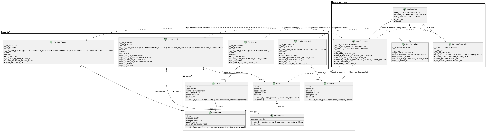

# ProjetoFinalFeira

Este projeto é um sistema web para gerenciamento de uma feira online, permitindo que usuários visualizem produtos, adicionem itens ao carrinho, e gerenciem pedidos. Já para administradores, que controlem produtos, estoque e clientes. A aplicação utiliza python com a framework Bottle e integrações com WebSockets (Socket.IO) para atualizações em tempo real.

## DIAGRAMA E RELAÇÕES UML
Relações UML

**Relações de Herança:**

- User e AdminUser:

AdminUser herda de User.

AdminUser é uma especialização de User, adicionando uma propriedade permissions e sobrescrevendo o método is_admin para retornar True.

**Relações de Associação**
- Application e Classes de View (HTML templates):

A classe Application contêm métodos como render_page e login que "usam" os seus arquivos HTML correspondentes. Embora não seja uma associação direta entre classes em Python, é uma associação forte na arquitetura do sistema.

- UserController e UserRecord:

UserController "tem um" uma instância de UserRecord. Self.__users = UserRecord() no método __init__ de UserController.

UserController utiliza métodos de UserRecord para gerenciar usuários (login, registro, busca por email/username, etc.).

- UserRecord e User/AdminUser:

UserRecord "tem muitos" User e AdminUser. A classe UserRecord gerencia listas de contas de usuário e contas de administrador e instancia objetos User ou AdminUser.

Os métodos read e book em UserRecord criam e gerenciam objetos User e AdminUser

- ProductController e ProductRecord:

ProductController "tem um" (usa) uma instância de ProductRecord.

ProductController utiliza ProductRecord para operações relacionadas a produtos.

- ProductRecord e Product:

ProductRecord "tem muitos" Product. A classe ProductRecord gerencia uma lista de produtos e instancia objetos Product.

Os métodos read e add_product em ProductRecord criam e gerenciam objetos Product.

- CartController e CartRecord/CartItemRecord/ProductRecord:

CartController "tem um" (usa) instâncias de CartRecord, CartItemRecord e ProductRecord.

CartController interage com essas classes para gerenciar o carrinho (visualizar, adicionar, remover, atualizar itens do carrinho e finalizar compra).

A interação com ProductRecord ocorre no método add_to_cart.

- CartRecord e Order:

CartRecord "tem muitos" Order. A classe CartRecord gerencia uma lista de todos os pedidos e instancia objetos Order.

Os métodos read e add_order em CartRecord criam e gerenciam objetos Order.

- CartItemRecord e OrderItem:

CartItemRecord "tem muitos" OrderItem.

Os métodos read e add_item em CartItemRecord criam e gerenciam objetos OrderItem.

- Order e OrderItem:

Order "tem muitos" OrderItem. A classe Order contém uma lista de items que são objetos OrderItem

Esta é uma relação de composição, pois os OrderItems existem no contexto de um Order. Se um Order for excluído, seus OrderItems associados também perdem sua função.

**Relações de Dependência**

Controllers dependem e utilizam as classes Record (UserRecord, ProductRecord, CartRecord, CartItemRecord) para organizar a lógica de negócios e serialização dos dados.

As classes Record dependem de Models (User, AdminUser, Product, Order, OrderItem) que representam os dados a serem organizados.

DIAGRAMA UML

## Funcionalidades Principais

### Para Clientes (Usuários Normais)
* **Registro e Login:** Criar novas contas e acesso ao sistema.
* **Listagem de Produtos:** Visualização dos produtos disponíveis na feira.
* **Detalhes do Produto:** Acesso a informações detalhadas de cada produto.
* **Carrinho de Compras:** Adição, remoção e atualização de quantidades de produtos no carrinho.
* **Finalização de Pedido:** Processo de checkout para converter o carrinho em um pedido.
* **Histórico de Pedidos:** Visualização de todos os pedidos anteriores e seus status.
* **Gerenciamento de Perfil:** Atualização de informações pessoais.

### Para Administradores
* **Dashboard Administrativo:** Visão geral do sistema.
* **Gerenciamento de Produtos:** Adicionar, editar e excluir produtos.
* **Gerenciamento de Estoque:** Atualização em tempo real do estoque de produtos.
* **Gerenciamento de Clientes:** Visualização e gerenciamento de contas de usuários.
* **Gerenciamento de Pedidos:** Acompanhamento e atualização do status dos pedidos.

## Estrutura de Pastas

.
├── .gitignore
├── README.md
├── app/
│   ├── controllers/
│   │   ├── application.py
│   │   ├── cartRecord.py
│   │   ├── cart_controller.py
│   │   ├── db/
│   │   │   ├── admin_accounts.json
│   │   │   ├── cart_items.json
│   │   │   ├── orders.json
│   │   │   ├── products.json
│   │   │   └── user_accounts.json
│   │   ├── productRecord.py
│   │   ├── product_controller.py
│   │   ├── userRecord.py
│   │   └── user_controller.py
│   ├── models/
│   │   ├── order.py
│   │   ├── product.py
│   │   └── user.py
│   ├── static/
│   │   ├── css/
│   │   │   ├── acess_den.css
│   │   │   ├── adm_style.css
│   │   │   ├── cliente_style.css
│   │   │   ├── criar_conta.css
│   │   │   ├── index.css
│   │   │   └── login.css
│   │   ├── images/
│   │   │   └── logo.jpg
│   │   └── js/
│   │       └── stock.js
│   └── views/
│       ├── acesso_neg.html
│       ├── administrador_clientes.html
│       ├── administrador_dashboard.html
│       ├── administrador_estoque.html
│       ├── cliente_carrinho.html
│       ├── cliente_pedidos.html
│       ├── cliente_perfil.html
│       ├── cliente_produto.html
│       ├── criar_conta.html
│       ├── error_404.tpl
│       ├── index.html
│       └── login.html
├── image.png                       # Diagrama UML
└── route.py

## Como Configurar e Executar

### Pré-requisitos
* Python 3.x
* pip

### 1. Clonar o Repositório e Instalar dependências

git clone https://github.com/beatrizbranfb/ProjetoFinalFeira.git
cd ProjetoFinalFeira

pip install bottle python-socketio eventlet

### 2. Executar a aplicação

python route.py

A aplicação estará acessível em http://localhost:8080.

### Credenciais padrão
(admin): 
email: administradores@gmail.com
senha: 123456